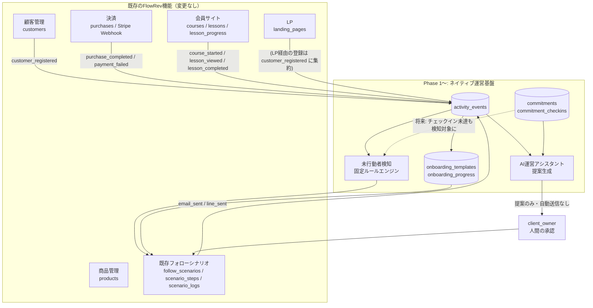

# FlowRev ネイティブ運営機能 コンセプト

対象ブランチ: `feature/phase-1-activity-events-foundation`（`claude/flowrev-phase-0-audit-fpgr8e` / PR #1 の内容がmainへマージされ次第、そこへrebase予定）

## 1. 背景：方針転換の理由

当初、購入後フォロー・コミットメント管理の一部機能はOnbizu・CommitRevという外部システムとの連携を前提に構想されていた。しかし、これらは以下の理由により不採用とする。

- 対象システムがReplitを中心に開発されており、API仕様の安定性が担保できない
- 認証・セキュリティモデルがFlowRevの4階層テナント構造（system_admin / white_label_owner / client_owner / customer、`docs/audit/04_DATABASE_AND_AUTH.md`参照）と整合する保証がない
- 継続保守性・データ整合性・障害時の切り分けが、外部システム側の変更に左右される
- FlowRevの中核運営機能が外部システムの可用性に依存することになり、「一人で回せる運営基盤」という製品コンセプト自体に反する

**方針**: Onbizu・CommitRevが表現しようとしていた「顧客の行動を捉え、未行動者をフォローし、コミットメントを伴走する」という概念そのものは有用であるため、これをFlowRevの標準機能として自前実装する。外部サービス固有の名称・データ構造・API仕様には一切依存しない。

## 2. 8つのネイティブ機能

| # | 機能 | 概要 | 対応Phase |
|---|---|---|---|
| 1 | オンボーディング管理 | 新規顧客が最初の一歩を踏み出せるよう、テンプレート化されたステップと進捗を管理する | Phase C |
| 2 | 行動イベント管理 | 顧客のあらゆる行動（登録・購入・ログイン・視聴・完了等）を単一のイベントストリームとして記録する | Phase A |
| 3 | 未行動者検知 | 固定ルールに基づき「行動すべきなのにしていない」顧客を検知する | Phase B |
| 4 | コミットメント管理 | 顧客が自ら設定した目標・週次行動を記録し、運営者が伴走する | Phase E |
| 5 | 購入後フォロー | 購入直後からの定着支援。既存の`follow_scenarios`エンジンを拡張して実現する | Phase D |
| 6 | メール・LINE自動化 | 条件に応じたメール／LINE配信。既存のResend・LINE連携を流用する | Phase D |
| 7 | 成果・売上分析 | 行動イベント・購入データを集計し、運営状況を可視化する | Phase A以降、随時 |
| 8 | AI運営アシスタント | 行動データを基にした「提案」を行う。自動実行はしない（後述） | Phase E以降 |

## 3. 全体アーキテクチャ

**設計意図**: `activity_events`を全機能の背骨（スパイン）とし、既存機能（顧客・購入・会員サイト）からはイベントを「記録するだけ」の一方向の依存にする。検知・オンボーディング・コミットメント管理は`activity_events`を読むだけで、既存機能のテーブルを直接いじらない。フォロー配信の実行自体は、新しいエンジンを作らず**既存の`follow_scenarios`/`scenario_steps`/`scenario_logs`を拡張**して使う（詳細は`ONBOARDING_AND_FOLLOWUP_MVP.md`）。

## 4. 設計原則と、既存コードベースへの適用

| 原則 | 既存コードベースでの具体的な適用 |
|---|---|
| マルチテナント対応必須 | `activity_events`等の新テーブルは、既存の`customers`/`products`等と同様に`white_label_id`・`client_id`列を持たせる（`docs/audit/04_DATABASE_AND_AUTH.md`の命名パターンに合わせる） |
| RLSを前提にする | 既存の`get_user_role()` / `get_user_client_id()` / `get_user_white_label_id()`（`supabase/migrations/0006_rls_functions.sql`）をそのまま再利用し、新規のSECURITY DEFINER関数は増やさない |
| 顧客行動はイベントとして記録する | `activity_events`テーブル＋記録サービス（`ACTIVITY_EVENT_CATALOG.md`参照）。**既存の`customers.last_action_at`列は現在どこからも書き込まれていないデッドコードであることが判明した**（後述5章）。新しいイベント基盤はこの列を復活させるのではなく、イベントストリームを一次情報源とし、`last_action_at`は将来的にイベントから導出するキャッシュ列として再定義する |
| 自動化処理と個別機能を密結合させない | 検知ロジック（Phase B）・オンボーディング（Phase C）は、どちらも「`follow_scenarios`にレコードを作る」ところまでで自分の責務を終える。実際の配信は既存の実行エンジン（`lib/repositories/scenario-execution.ts`）が担う。検知ロジック自身がメール送信APIを直接呼ばない |
| 外部連携は将来アダプターとして追加できる構成にする | イベント記録・検知・配信のいずれも、FlowRev内部のテーブル・関数のみに依存する形で設計する。将来Onbizu的な外部データソースを繋ぐ場合は、「外部イベントを`activity_events`に変換して投入するアダプター」を追加するだけで済む構成とし、コア機能側の改修を不要にする（本Phaseではアダプターの実装は行わない） |
| 最初から高機能なビジュアルシナリオビルダーを作らない | Phase Dでは既存の`scenario_steps`（ステップ番号＋delay_days＋channel）以上のUIは作らない。条件分岐や並列フローは実装しない |
| 固定ルールと簡易条件設定から始める | Phase Bの未行動者検知は5つの固定ルール（購入後24時間ログインなし等）をハードコードした条件式で実装し、ルールビルダーUIは作らない |
| AIによる完全自動送信は後回しにし、提案・承認型とする | AI運営アシスタント（Phase E以降）は、既存の`lib/ai/client.ts`（Anthropic）を使って「フォロー文面の提案」「コミットメント達成状況へのコメント案」等を生成するが、**生成結果は必ず`client_owner`の確認・編集・送信操作を経る**。既存のAI文章生成ボタン（`features/ai/components/ai-generate-button.tsx`）と同じUXパターン（生成→人間が確認→保存）を踏襲する |

## 5. 既存コードの重要な事前調査結果（設計に影響する事実）

ドキュメント作成にあたり既存コードを調査した結果、以下の重要な事実が判明した。これらはPhase 1以降の実装方針に直接影響する。

1. **`customers.last_action_at`列は存在するが、現在どこからも書き込まれていない。** スキーマ（`supabase/migrations/0006_customers.sql:18`）・リポジトリ層（`lib/repositories/customers.ts`）・4箇所の「7日間未行動」判定ロジック（`lib/repositories/stats.ts`、`app/(dashboard)/customers/page.tsx`、`features/customers/components/customer-table.tsx`、`app/api/customers/export/route.ts`）はすべてこの列を**読む**が、**書き込むコードが一切存在しない**。つまり現在のダッシュボードの「未行動」表示は常に「登録後一度もアクションがない」状態としてしか機能しない。Phase Aでイベント記録基盤を作った時点で、この4箇所の重複ロジックを`activity_events`ベースの単一ロジックに統合することが強く推奨される（詳細は`PHASE_1_IMPLEMENTATION_PLAN.md`）。
2. **Stripe Webhookは`checkout.session.completed`のみを処理しており、決済失敗・期限切れイベントを一切扱っていない**（`app/api/webhooks/stripe/route.ts:69`）。`payment_failed`イベントを記録するには、このWebhookハンドラに新しいケースを追加する必要がある。
3. **ログイン処理（`features/auth/actions.ts`のログイン`login()`）は顧客・スタッフ共通で、ログイン日時を記録する仕組みが一切ない。** `first_login`イベントを実装するには、ここに新しい記録ロジックを追加する必要がある。
4. **会員サイトのレッスン視聴には「開始」状態が存在しない。** 現状は「完了」ボタンを押した時のみ`lesson_progress`が更新される（`app/api/my/progress/route.ts`）。`lesson_viewed`（視聴開始）イベントを実装するには、ページ表示時に発火する新しい記録ポイントが必要。
5. **「課題（assignment）」機能はコードベースのどこにも存在しない。** `assignment_submitted`イベントおよび未行動者検知ルール「課題期限超過」は、この機能が別途実装されるまで有効化できない。Phase 1〜Eのスコープからは除外し、将来の課題機能実装時に追加する前提とする（詳細は各該当ドキュメントに記載）。
6. **既存の`follow_scenarios.trigger_type`には`"no_action"`・`"course_complete"`という値がZodスキーマ・UI上は既に選択可能だが、実際にシナリオを起動するコードは`"purchase"`にしか実装されていない**（`lib/repositories/scenario-execution.ts:32`の`enqueuePurchaseScenarios`のみ）。Phase B/Dは、この既存の空きトリガーを実際に機能させる形で設計する。
7. **シナリオ実行エンジン（`app/api/admin/scenarios/execute/route.ts`）自体はメール・LINE両チャネルの送信ロジックをすでに実装済み**（`log.channel === "line"`分岐で`sendLinePushMessage`、それ以外で`sendScenarioStepEmail`）。ただし自動トリガー（Cron）が存在しないこと、LINE送信には`customers.line_user_id`が必要だが埋める手段（LINE Webhook）が存在しないことは、Phase 0監査（`docs/audit/02_FEATURE_MATRIX.md`）で既に指摘済みで未解消。Phase Dのフォロー自動化はこの既存エンジンを土台にするため、これらの既存課題も併せて解消範囲に含める。

## 6. Phase 1のスコープ

本ドキュメント一式が対象とするのは **Phase A（行動イベント基盤）のみ**である。Phase B〜Eは設計文書として残すが、コード実装は別途承認を得てから着手する。詳細な実装計画は`PHASE_1_IMPLEMENTATION_PLAN.md`を参照。

## 7. 非目標（Phase 1時点で明示的にやらないこと）

- ビジュアルなシナリオビルダー（ドラッグ&ドロップでのフロー編集）
- AIによる完全自動送信（人間の承認なしにメール・LINEが送られること）
- Onbizu・CommitRev等、外部システムとの実際の連携実装（アダプターの「型」を意識した設計はするが、アダプター自体は作らない）
- 課題（assignment）機能そのものの実装
- 未行動者検知のルールをテナントごとにカスタマイズできるUI（Phase Bは固定5ルールのみ）
